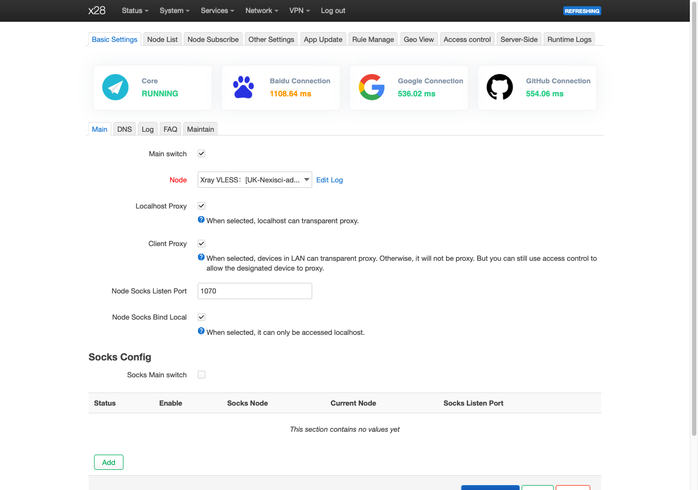
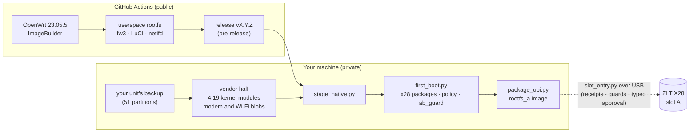
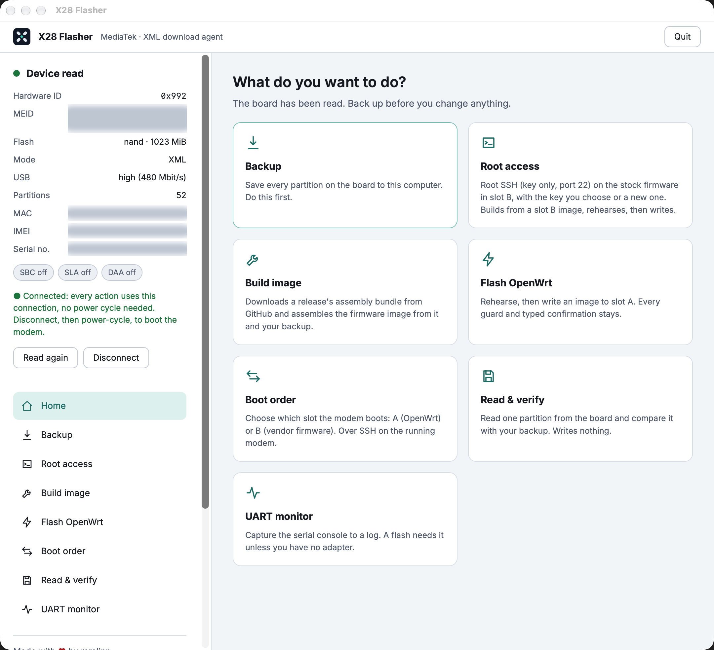

<picture>
  <source media="(prefers-color-scheme: dark)" srcset="docs/assets/logo-dark.svg">
  
</picture>

# X28 OpenWrt

**A native OpenWrt 23.05 for the ZLT X28 5G CPE, with WireGuard, OpenVPN, L2TP, PPTP and Passwall2 built in: recovery-first, built in the open, running on a real unit.**

-orange)

[Status](#status) · [VPN and Passwall2](#vpn-and-passwall2) · [Roadmap](#roadmap-to-a-stable-release) · [How it works](#how-it-works) · [Build](#build-and-flash) · [Changelog](CHANGELOG.md) · [Tests](docs/TESTING.md) · [Docs](docs/README.md) · [Contributing](#contributing)

> [!WARNING]
> **Your device, your risk.** The X28 is usually someone's only internet connection, and flashing it means
> writing its NAND over the MediaTek download agent. The native image has been flashed to slot A and boots on
> **one tested unit**; the procedure is guarded and owner-approved step by step, and needs a verified backup and a
> UART. It is not a consumer installer. Read [docs/RECOVERY.md](docs/RECOVERY.md) before touching anything.
> Not affiliated with ZLT, Tozed, MediaTek or Quectel.

> [!NOTE]
> **Tested on stock firmware 1.5 and 8.6.8.** To boot `slot A` you must change the boot order, which needs `SSH` or
> `telnet` on the stock system. `firmware 1.5` lets you get that, and **SSH access now also works on `firmware 8.6.8`**.
> It is valid up to `8.6.28`, for both the unlock and OpenWrt, on the **X28, X28 Pro, X28 V-Pro and X28 Pro (Ooredoo)**.
> The [x28-flasher](https://github.com/mralinp/x28-flasher) repo is **private for now** because it still needs changes
> for `8.6.x`, so the flashing steps below are reference, not something you can run.

## Why

The ZLT X28 (MediaTek MT6890/T750, Quectel RG500L modem) ships a locked-down OpenWrt 19.07 with a vendor web
UI. This project puts a **normal OpenWrt** on it: stock LuCI and UCI, netifd, standard DHCP and firewall,
**VPN clients and Passwall2 that work on the vendor kernel**, a cooler box, and local SMS/voice for AI projects, **without losing the ability to recover the unit**. So it goes
recovery first: back up everything, prove a way back, then build and flash.

## Status

One unit, one SIM, one carrier. Current release: see the badge above; the full state is in [docs/STATUS.md](docs/STATUS.md).

| Area | State |
|---|---|
| Full NAND backup (51 partitions, hash-verified) | ✅ done |
| USB recovery: preloader + download agent | ✅ all 51 partitions read over USB; `rootfs_a` and `rootfs_sig_a` written and restored with guarded tools |
| Native OpenWrt 23.05.5 on slot A (vendor 4.19.205 kernel, fw3 + iptables-legacy) | ✅ boots; stock slot B untouched |
| 5G data as a normal netifd interface (`x28_mipc`: IPv4, IPv6, IPv4v6, APN from the SIM) | ✅ works, with its own LuCI protocol page and Carrier tab (operator and scan, band and cell lock, roaming, modem status) |
| LuCI over HTTPS (self-signed, HTTP redirected), LAN bridge (4 sockets), DHCP/DNS, IPv6 on the LAN, firewall and NAT | ✅ works; root has an empty password until you set one |
| WireGuard (our module for the vendor kernel) | ✅ up to 715 Mbit/s sending, CPU not saturated ([below](#vpn-and-passwall2)) |
| OpenVPN client | ✅ about 100 Mbit/s, one CPU core is the limit |
| L2TP and PPTP clients | 🟡 installed, protocols in netifd and LuCI; not yet tested against a server |
| Passwall2 (xray, TPROXY modules we build) | ✅ whole LAN through the node: TCP, UDP and IPv6, switched from LuCI, survives a reboot |
| Wi-Fi (MT7915 dual band, vendor `mt_wifi` through a netifd handler) | 🟡 both radios come up with WPA2 and a phone works through them; throughput tests pending |
| Front panel LEDs (radio, signal, WAN) | ✅ works |
| Everything at boot, settings surviving reboots, SSH key-only on port 22 | ✅ works |
| A/B boot counter | ✅ the preloader adds a try per boot; `x28-bootok` resets it after a good boot, like stock |
| Slot A marked successful | ❌ deliberately not: success stays 0 so the fall-back to stock B remains (see [BOOT-FLOW](docs/BOOT-FLOW.md)) |
| Temperature | ✅ about 40 °C idle on the SoC (stock 65 °C idle without a fan, 46 °C with the 12 V fan) |
| SMS and voice | 🗓️ worked on the stock-firmware overlay (voice blocked by the SIM); not yet on the native image |
| `opkg` with a signed feed for this device line | ✅ 205 of the 976 official kernel packages install (built for this kernel), the rest are refused cleanly: [PACKAGE-FEED](docs/PACKAGE-FEED.md) |
| Recovery slot, sysupgrade, fan control, own kernel | 🗓️ planned, see the roadmap |

Every ✅ links to evidence and a reproduce command in **[docs/TESTING.md](docs/TESTING.md)**. The vendor modem
stack is closed-source and not redistributable, so what this repository publishes is the **build tooling and the
packages**, not a ready-to-flash image: the image is assembled locally from your own unit's backup.

## VPN and Passwall2

These were the main reasons to replace the stock firmware. **Every image ships all of them preinstalled, ready to
configure on a clean flash**, before any of your settings: the build refuses to make an image without the WireGuard and TPROXY modules
and `ipset`. Configure them from
stock LuCI pages:

| | How it runs on the vendor 4.19.205 kernel |
|---|---|
| **WireGuard** | The kernel has none. We build `wireguard-linux-compat` against the kernel tree ([`package/x28-kmods`](package/x28-kmods/README.md)) and load it after a good boot, with a crash guard ([#227](https://github.com/mralinp/zlt-x28-openwrt/issues/227)) |
| **OpenVPN** | `openvpn-openssl` and `luci-app-openvpn`, `tun` from the stock kernel |
| **L2TP, PPTP** | `xl2tpd` and `ppp-mod-pptp` as LuCI interfaces |
| **Passwall2** | xray on the iptables path (no nftables here), with TPROXY and socket modules we build, plus a small shim for two symbols the kernel never exported ([PASSWALL2](docs/PASSWALL2.md)) |

What the X28 can carry with this firmware, measured on the unit on 2026-11-02 ([TESTING 37](docs/TESTING.md#37-vpn-speed-and-cpu-limits-on-the-router-2026-11-02),
[PASSWALL2](docs/PASSWALL2.md#what-the-device-can-carry)). WireGuard and OpenVPN ran `iperf3` between the router and a LAN
peer, so the carrier and the far server are out of the picture:

| Tunnel | Router sends | Router receives | CPU (4 cores) | What limits it |
|---|---|---|---|---|
| None (reference) | 856 Mbit/s | 363 Mbit/s | 9–36% | the test laptop's path |
| WireGuard, 4 streams | 715 Mbit/s | 330 Mbit/s | 55–58% | not reached |
| OpenVPN AES-128-GCM (mbed TLS) | 102 Mbit/s | 58 Mbit/s | 24–27% | one core |
| OpenVPN AES-256-GCM (OpenSSL, the shipped build) | 74 Mbit/s | 84 Mbit/s | 25–27% | one core |
| Passwall2 / xray, LAN client | 40 Mbit/s | 206 Mbit/s measured, about 400 estimated | 56% peak, xray 1.1 cores | the link, not the router |

**Pushing it further** ([details](docs/PASSWALL2.md#pushing-it-further)):

- **WireGuard** for raw speed: it runs in the kernel on all four cores and had headroom at 715 Mbit/s.
- **OpenVPN** is single-threaded at about 100 Mbit/s per tunnel: use UDP and AES-GCM, or split traffic across tunnels.
- **Passwall2** scales with streams and cores: pick a light transport (fewer layers than XHTTP over TLS), keep logs at
  `warn`, and try packet steering, since `cpu0` takes all network interrupts.
- **Heat** is not the limit so far: the SoC idles about 40 °C on this firmware and stayed under 48 °C in these tests.
  A fan or the `performance` CPU governor buys more for sustained loads.

Not yet measured: LAN clients forwarded through each tunnel, L2TP and PPTP against a server, the Passwall2 ceiling
itself, the tuning ideas, and WireGuard over hours.

## Roadmap to a stable release

The target layout is simpler than today's two full firmwares:

- **Slot A: stable OpenWrt**, the thing you run.
- **Slot B: a recovery slot**, a small kernel and recovery path that can rescue the box and install or reinstall
  OpenWrt on slot A, and put the stock firmware back if you want it. This frees the flash that now holds a second
  full firmware and removes the need for the download agent and a UART in everyday recovery.

Roughly in order ([PROJECT-PLAN](docs/PROJECT-PLAN.md) has the detail):

1. Soak and test the slot-A image: 48 h without unexplained reboots, Wi-Fi client and throughput tests, more LED
   states, the idle CPU and RAM baseline.
2. Design and build the recovery slot, including the way back to stock.
3. `sysupgrade` for the new layout.
4. A tagged stable release, the device page for the OpenWrt wiki, and build documentation for other owners.
5. Later: fan control from LuCI ([#47](https://github.com/mralinp/zlt-x28-openwrt/issues/47)), local SMS and voice
   on the native image, and a 4.19 kernel plus kmod feed built from a sibling-device SDK
   ([#130](https://github.com/mralinp/zlt-x28-openwrt/issues/130)).

## How it works

```mermaid
flowchart LR
    subgraph CI["GitHub Actions (public)"]
        IB["OpenWrt 23.05.5<br/>ImageBuilder"] --> U["userspace rootfs<br/>fw3 · LuCI · netifd"]
        U --> R["release vX.Y.Z<br/>(pre-release)"]
    end
    subgraph LOCAL["Your machine (private)"]
        B["your unit's backup<br/>(51 partitions)"] --> V["vendor half<br/>4.19 kernel modules<br/>modem and Wi-Fi blobs"]
        R --> S["stage_native.py"]
        V --> S
        S --> F["first_boot.py<br/>x28 packages · policy · ab_guard"]
        F --> P["package_ubi.py<br/>rootfs_a image"]
    end
    P -. "slot_entry.py over USB<br/>(receipts · guards · typed approval)" .-> X28[("ZLT X28<br/>slot A")]
```

- **Open half in CI.** Official 23.05.5 packages, assembled with ImageBuilder. The firewall is fw3 because the
  stock kernel has no `nf_tables`.
- **Vendor half stays local.** The stock kernel modules and vendor binaries are proprietary and specific to a
  firmware build, so they are taken from **your own unit's backup** and never enter this public repo or CI.
- **Our packages** (`package/`): `x28-mipc` (cellular netifd protocol) with its LuCI page, `x28-modem` (starts the
  vendor modem stack), `x28-wifi`, `x28-leds`, `x28-bootok` (A/B boot counter) and `x28-kmods` (WireGuard and TPROXY
  modules for the vendor kernel: sources here, built locally against the kernel tree, loaded after a good boot).
- **Guarded flashing.** The tools in [mralinp/x28-flasher](https://github.com/mralinp/x28-flasher) (`tools/recovery/` there) write only the targets they were built for, check the other
  slot and neighbouring partitions before and after every write, and need a typed phrase from the owner.

## The flasher app

[x28-flasher](https://github.com/mralinp/x28-flasher) is the companion app that gets this firmware onto a unit: one window for backup, building the image
and flashing, with every guard and typed confirmation of the recovery procedure built in. It is private until it is ready, then public.

| Step | What it is for |
|---|---|
| Connect | Finds the modem over USB and reads what it is. One connection serves every step: no power cycle between them. |
| Backup | Saves every partition to your computer, hash-checked. Always first. |
| Root access | Once on a fresh unit: key-only SSH on the stock firmware (slot B), from a fresh read of it. |
| Build image | Assembles the image for your own unit from a release's `x28-assembly-*` bundle and your backup. |
| Flash OpenWrt | Writes slot A behind a rehearsal and a phrase you type yourself. Slot B (stock) is left as the fallback. |
| Boot order | A switch between slot A (OpenWrt) and slot B (stock), over SSH on the running modem. |
| Read & verify | Reads a partition back and compares it with your backup. |

It runs as a native window on macOS (Apple silicon), and as installers for Linux and Windows built by its CI. The screenshot hides the unit's
identifiers. Read [Build and flash](#build-and-flash) and the recovery docs before you use it.

Note: This flasher enables SSH with root access on firmware versions up to 8.6.26. I haven't been able to find newer versions to test, so if you have one, please let me know by opening an issue.

> **Note:** Gaining root access also makes it possible to unlock carrier-locked units. The device stores its carrier-lock settings in a configuration file. Simply set all unlock-code fields to 0 and clear the carrier list to allow SIM cards from any carrier. Ez pz! 😎

## Build and flash

Backup, USB access, image assembly and flashing belong to [mralinp/x28-flasher](https://github.com/mralinp/x28-flasher)
(private for now). It downloads the latest release's `x28-assembly-*` bundle from here and assembles the image locally
from your own unit's backup. You need a ZLT X28, a **USB-A-to-USB-C** cable (C-to-C does not work) and a **1.8 V** UART
path ([RECOVERY](docs/RECOVERY.md#uart-debug-console-2-read-side-confirmed)). The steps, gates and typed approvals are in
[docs/BUILD.md](docs/BUILD.md), [docs/RECOVERY.md](docs/RECOVERY.md) and
[docs/research/rootfs-a-write-plan.md](docs/research/rootfs-a-write-plan.md). Read them first.

## Documentation

Start with [docs/TESTING.md](docs/TESTING.md) for evidence and [docs/STATUS.md](docs/STATUS.md) for the current state.
[docs/README.md](docs/README.md) is the full index and code map; the main ones:
[PROJECT-PLAN](docs/PROJECT-PLAN.md), [BUILD](docs/BUILD.md), [RECOVERY](docs/RECOVERY.md), [BOOT-FLOW](docs/BOOT-FLOW.md),
[NATIVE-CELLULAR](docs/NATIVE-CELLULAR.md), [PACKAGE-FEED](docs/PACKAGE-FEED.md), [PASSWALL2](docs/PASSWALL2.md), [THERMAL](docs/THERMAL.md),
[WORKFLOW](docs/WORKFLOW.md), the [kmod gap analysis](docs/research/kmod-gap.md) (what it takes to carry every official package) and the [CHANGELOG](CHANGELOG.md).

## Releases

A merge to `main` that changes shippable files is released automatically (docs-only and CI-only merges are not). The version comes from the PR title (Conventional Commits:
`feat` → minor, `type!` → major, otherwise patch); 0.x releases are pre-releases. Each release publishes one
`x28-assembly-vX.Y.Z.tar.gz` bundle (userspace, package files, kernel modules, extra packages). A release alone does not boot the X28 (the vendor half is
added locally); see [docs/BUILD.md](docs/BUILD.md). What changed, release by release: [CHANGELOG.md](CHANGELOG.md).

## Contributing

Issues are the unit of work; every change is a branch (`feature|fix|docs|chore|research/<issue>-slug`) and a
squash-merged PR with a Conventional Commit title. Changes that touch the device need a safety note and a
rollback. Read [docs/WORKFLOW.md](docs/WORKFLOW.md); the project's rules for AI agents are in [CLAUDE.md](CLAUDE.md).
Owners of the same box, or its rebrands (MT6890 + MT7915 + MT7531), are very welcome: compare notes in an issue.

## Credits

[EngineerMazeed/ZLT-X28](https://github.com/EngineerMazeed/ZLT-X28) got LuCI onto the stock firmware.
[mt6890-cpe-recovery](https://github.com/mt6890-cpe-recovery/mt6890-cpe-recovery) published the X28 SP Flash
Tool package with Quectel's download agent. [bkerler/mtkclient](https://github.com/bkerler/mtkclient) does the
USB work. [gaglians/zlt-x28-openwrt2305](https://github.com/gaglians/zlt-x28-openwrt2305) explored 23.05 on the
vendor kernel. OpenWrt and LuCI belong to their projects.

## Support

Made with ❤️ by mralinp. If this project helps you, please give it a star on GitHub, and donations are welcome on any EVM chain: `0x6743d8fe71f18b3101f3086e8d9f8d272d0f7618`

## License

Copyright (C) 2026 Ali Naderi Parizi. The code in this repository is free software under the [GNU GPL v3](LICENSE) (or any later version): anyone may use, modify and redistribute it, but any distributed derivative must be released under the same licence with its complete source, and must keep this copyright notice and credit the original project. OpenWrt, LuCI, mtkclient and vendor components keep their own
licences. Vendor firmware is never distributed here.
